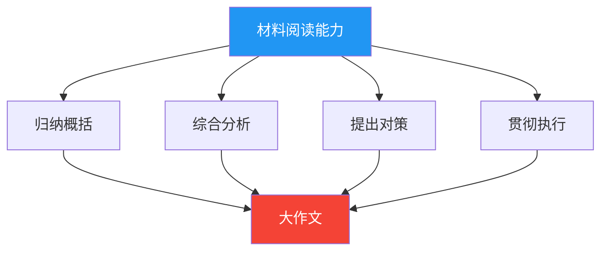

---
title: 申论备考指南
description: 申论五大题型备考路径
tags: [申论]
date: 2026-06-23
iteration: 1
status: done
category: shenlun
---

# 申论备考指南

申论考查的核心能力：**阅读理解 → 综合分析 → 提出和解决问题 → 文字表达**

## 五大题型

| 题型 | 分值（约） | 难度 | 关键能力 |
|------|-----------|------|----------|
| [归纳概括](guina/index.md) | 10-15分 | ⭐⭐ | 从材料中提炼要点 |
| [综合分析](zonghe/index.md) | 10-15分 | ⭐⭐⭐ | 多角度分析+逻辑表达 |
| [提出对策](tichu/index.md) | 10-15分 | ⭐⭐⭐ | 问题定位+可行性对策 |
| [贯彻执行](guanche/index.md) | 15-20分 | ⭐⭐⭐ | 公文格式+内容组织 |
| [大作文](dazuowen/index.md) | 35-40分 | ⭐⭐⭐⭐ | 论点+论据+结构+语言 |

## 申论学习路径

## 核心原则

- **答案来自材料**：80%以上的得分点都在材料中
- **要点化作答**：分条列点，不要写成大段散文
- **规范化表达**：避免口语化，使用政策性语言
