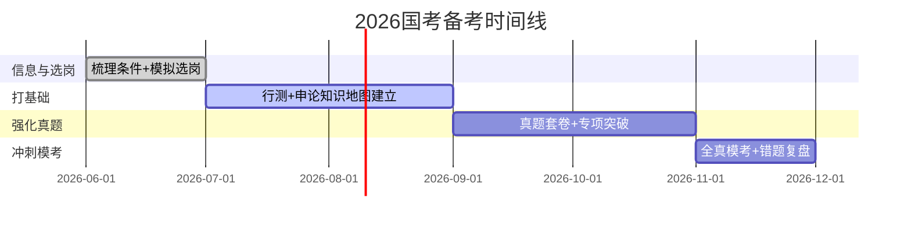

---
title: 备考规划总览
description: 2026国考备考整体规划
tags: [规划, 入门]
date: 2026-06-23
iteration: 1
status: done
category: overview
---

# 备考规划总览

## 考试科目

| 类别 | 科目 | 说明 |
|------|------|------|
| A类（综合管理） | 行测 + 申论 | 大部分中央机关岗位 |
| B类（行政执法） | 行测 + 申论（执法卷） | 部分执法类岗位 |

> 具体以当年公告为准，参考国家公务员局官网。

## 四阶段备考节奏

### 阶段A：信息与选岗（现在 ~ 6月底）

- 梳理硬条件：学历、专业代码、应届身份、政治面貌、证书、基层经历
- 拉3年职位表做筛选，确认有可报岗位
- 明确目标优先级：地区 > 单位 > 岗位

### 阶段B：打基础（7月 ~ 8月）

- 行测五大模块逐模块过（不求速度，求理解）
- 申论五类题型框架和材料阅读方法
- 每天固定练习

### 阶段C：强化真题（9月 ~ 10月）

- 近5年国考真题套卷限时做
- 行测提分优先级：资料分析 > 判断推理 > 言语理解
- 申论重点：材料分层、要点提取、答案结构化

### 阶段D：冲刺模考（报名后 ~ 考前2周）

- 每周2-3次全真模考（严格计时）
- 建立"错题—错因—下次怎么避免"复盘闭环
- 调整做题顺序（先稳分模块、后拿分模块）

## 每日备考模板

=== "工作日（2-3小时）"

    | 时间 | 内容 |
    |------|------|
    | 45min | 行测模块专项（轮换） |
    | 60min | 申论练习（题型单练或材料拆解） |
    | 30min | 错题复盘 |
    | 15-30min | 时政/常识积累 |

=== "周末（4-6小时）"

    | 时间 | 内容 |
    |------|------|
    | 2-3h | 1套行测真题/模考 + 复盘 |
    | 2-3h | 1套申论套卷（或大作文+贯彻执行精批） |
