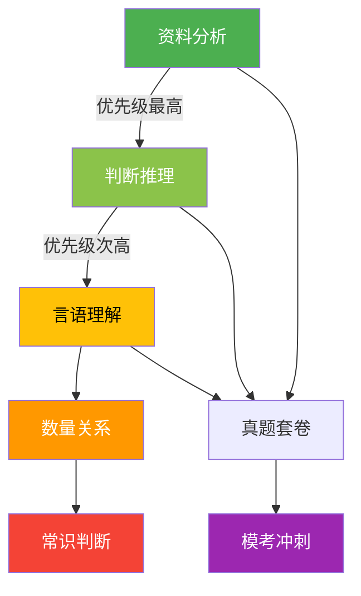
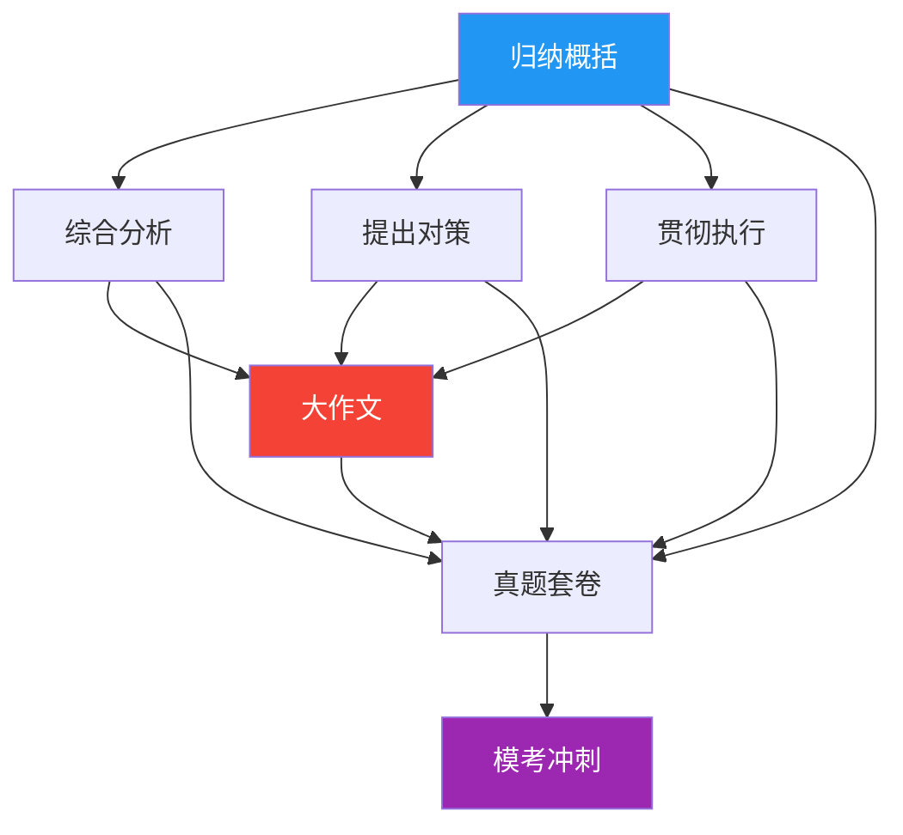

# 主流通用路径图

> 基于 16 条样本（10 条课程样本 + 6 条路径共识样本）得出的主流通关路径。

## 样本覆盖度总览

| 模块 | 课程样本数 | 路径共识 | 综合置信度 |
|------|-----------|---------|-----------|
| 资料分析 | 2 | 资料分析优先 | 高 |
| 判断推理 | 1 | 判断推理次之 | 高 |
| 言语理解 | 1 | 言语再次之 | 中高 |
| 数量关系 | 1 | 策略性取舍 | 高 |
| 常识判断 | 0 | 碎片积累 | 高 |
| 申论（全题型） | 5 | 先题型后套卷 | 高 |
| 真题库 | 0 | 近5年优先 | 高 |
| 模考记录 | 0 | 冲刺周频 | 高 |

## 行测主流通关路径

### 路径解读

1. **资料分析先行**：高频共识一致，提分性价比最高（样本：bilibili-liuwenchao-ziliao、bilibili-gaozhao-ziliao）。
2. **判断推理紧随**：40 题量大、方法系统化后正确率稳定（样本：bilibili-liuwenchao-panduan）。
3. **言语理解第三**：需要积累但不要一开始就堆（样本：bilibili-huoke-yanyu）。
4. **数量关系策略取舍**：时间有限优先基础题型（共识：guide-shuliang-strategy）。
5. **常识判断碎片化**：不建议专项大投入（共识：guide-changshi-fragment）。

## 申论主流通关路径

### 路径解读

1. **归纳概括是基础**：所有申论题型的底层能力（共识：guide-common-shenlun-first）。
2. **贯彻执行是分值大户**：15-20 分，格式+内容并重。
3. **大作文最后突破**：依赖前面题型积累的材料分析能力。
4. **真题精讲课辅助转化**：白鹭真题100讲适合方法到题目的落地（样本：bilibili-bailu-shenlun-zhenti）。

## 高频课程组合推荐

### 组合A：高效提分型（推荐）

| 模块 | 课程 | 样本ID |
|------|------|--------|
| 资料分析 | 刘文超基础 + 高照实战 | bilibili-liuwenchao-ziliao + bilibili-gaozhao-ziliao |
| 判断推理 | 刘文超系统课 | bilibili-liuwenchao-panduan |
| 言语理解 | 霍克系统课 | bilibili-huoke-yanyu |
| 申论 | 小马哥 + 白鹭真题 | bilibili-gongkao-xiaoma-ge-shenlun + bilibili-bailu-shenlun-zhenti |

### 组合B：大机构统一型

| 模块 | 课程 | 样本ID |
|------|------|--------|
| 全科 | 粉笔980系统班 | bilibili-fenbi-system |
| 申论加强 | 贺冲（含批改） | bilibili-hechong-shenlun-batch |

### 组合C：多源对比型

| 模块 | 课程 | 样本ID |
|------|------|--------|
| 申论 | 小马哥 + 郑岳峰 + 白鹭 | 3 个申论样本对比 |

## 数据局限性说明

- 当前样本池 16 条，覆盖主流通关路径但未穷尽所有UP主。
- 课程样本以B站免费/半免费资源为主，未包含付费班内部资料。
- 路径共识基于公开攻略归纳，未做大规模问卷量化。
- 下一步可扩展：知乎高赞回答、上岸经验帖、机构官方路径建议。
